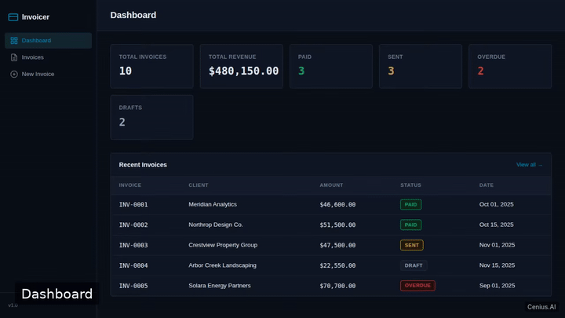
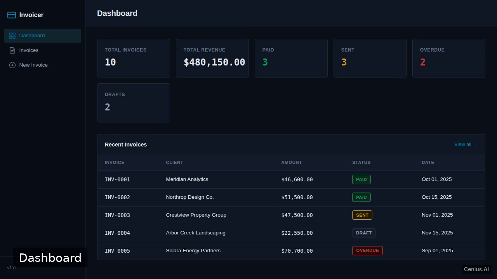
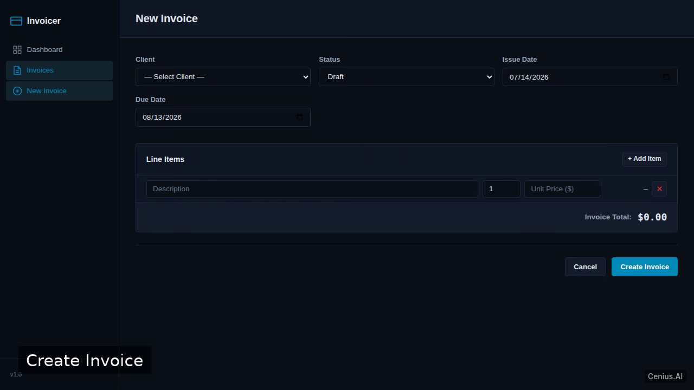

# Invoicing Web App — complete V invoice personal finance tracker example app

Most open-source personal finance tracker projects ship a skeleton. **Invoicing Web App** ships the whole thing: production-ready V source, seeded demo data, and a Invoicing Web App install script that runs in minutes. A polished multi-page invoicing application built with Laravel and SQLite. Apache-2.0-licensed — [remix Invoicing Web App on cenius.ai](https://cenius.ai/marketplace/p/invoicing-web-app?ref=gh&utm_campaign=invoicing-web-app-vlang) for your own branded build.


[](LICENSE)  [](https://cenius.ai)

[](https://cenius.ai/marketplace/p/invoicing-web-app?ref=gh&utm_campaign=invoicing-web-app-vlang)

> **▶ [Open & edit in cenius.ai](https://cenius.ai/marketplace/p/invoicing-web-app?ref=gh&utm_campaign=invoicing-web-app-vlang)** — one click to an editable workspace: describe changes in plain English, get an instant preview, one-click deploy and host. Modifications made on the platform come with full rebrand & relicense rights.

_Local clone? See [Quick start](#quick-start) below. cenius.ai is the zero-setup path._

## Demo



▶ **[Watch the full demo video](https://cenius.ai/marketplace/p/invoicing-web-app?ref=gh&utm_campaign=invoicing-web-app-vlang)** — the complete walkthrough, playing on the project's cenius.ai page · [MP4 file](.github/media/demo.mp4)

## Screenshots

  

## Usage guide

Start the development server (see [INSTALL.md](INSTALL.md)) and open `http://localhost:8000` in a browser.

### Pages

- **Dashboard** – shows summary counts (e.g., total invoices, paid/unpaid totals). Access via the navigation bar or `/`.
- **Invoices** – lists all invoices with status, client name, and total. Click an invoice to view details, or use the "New Invoice" button to create one.
- **Invoice Detail** – displays a client’s information, line items (description, quantity, unit price), subtotal, and grand total. Status can be changed if the invoice is editable.
- **Create / Edit Invoice** – form with fields: client selection, line item addition (description, quantity, price), invoice status (draft, sent, paid, etc.).

### Navigation

A Blade‑powered navigation menu links to the Dashboard and Invoices list. The invoice detail page provides a back link to the list.

_Full guide: [`USAGE.md`](USAGE.md)_

## Features

- Dashboard with totals
- Invoices list
- Invoice detail page
- Create invoice
- Edit invoice
- Navigation between screens
- Data seeding

## Quick start

```bash
./install.sh   # installs dependencies + seeds demo data
```

See [`INSTALL.md`](INSTALL.md) for full setup and usage instructions.

## Architecture

`install.sh` wires up dependencies and loads seed records; after it runs the app has real data to show. The V codebase (6,001 files) is self-contained — no external services needed to evaluate it. Top-level layout: `app/`, `bootstrap/`, `config/`, `database/`, `public/`, `resources/`, `routes/`, `storage/`. Step-by-step setup guide: [`INSTALL.md`](INSTALL.md).

## FAQ

### Can I deploy Invoicing Web App on my own infrastructure?

It runs entirely on your own machine. Clone, run `./install.sh`, and follow [`INSTALL.md`](INSTALL.md) — the whole stack is in this repo, no external dependencies required.

### How do I make Invoicing Web App my own brand?

White-labeling is supported: fork the MIT-licensed source and rebrand it yourself, or use [cenius.ai](https://cenius.ai/marketplace/p/invoicing-web-app?ref=gh&utm_campaign=invoicing-web-app-vlang) to make changes in a guided workspace — platform modifications come with full rebrand rights.

### What is Invoicing Web App built with?

V. The full source in this repository is exactly what the app runs. Highlights include create invoice.

### Is Invoicing Web App editable without a developer?

The easiest route: [visit the project on cenius.ai](https://cenius.ai/marketplace/p/invoicing-web-app?ref=gh&utm_campaign=invoicing-web-app-vlang), tell the platform what to change, and collect the updated build. No source-editing needed.

### Does the Invoicing Web App license allow commercial use?

It is. Apache-2.0 licensing means you can build a product on it, sell it, or use it inside a company with no fees. Details: [LICENSE](LICENSE).

## License & rebranding

Released under the [Apache License 2.0](LICENSE) (© 2026 Cenius AI) — free for personal and commercial use. The Cenius name/logo are trademarks (see NOTICE).

**Need a customized version?** [Remix this app on cenius.ai](https://cenius.ai/marketplace/p/invoicing-web-app?ref=gh&utm_campaign=invoicing-web-app-vlang) — modifications made on the platform come with **full rebrand & relicense rights** over your derivative.

## Built with cenius.ai

This entire application — code, design, seeded demo data — was generated on **[cenius.ai](https://cenius.ai)** from a plain-English description.

- 🚀 [Build your own app on cenius.ai](https://cenius.ai)
- 🎛️ [Remix Invoicing Web App on the marketplace](https://cenius.ai/marketplace/p/invoicing-web-app?ref=gh&utm_campaign=invoicing-web-app-vlang) — open it in a workspace, prompt for changes, and ship your own version.

More open-source apps: [the Cenius-ai catalog](https://github.com/Cenius-ai) · [showcase index](https://github.com/Cenius-ai/showcase)
